# ITRI_EasyDevOps

1. ### 描述：

   ITRI_EasyDevOps 專案的主要用於 CI/CD DevOps 的容器化工具集。容器化有助於方便部署和管理。目標是讓開發團隊能夠專注於開發本身，而不需花費過多時間處理""環境設置和部署的瑣碎事務""。透過容器化，我們致力於提供一個方便且快速的開發環境，讓 CICD DevOps 變得更加順暢。

2. ### 功能：

   - SonarQube：程式碼靜態分析工具，幫助確保程式碼品質，發現潛在的程式碼問題。
   - Jenkins：流程自動化工具，用於建置、測試和部署程式碼。
   - PostgreSQL：強大的開源關聯式資料庫，用於儲存和管理專案所需的資料。

3. ### SonarQube ( image: sonarqube:9.9-community )

   image: sonarqube:9.9-community  

   LTS SONARQUBE_VERSION=9.9.1.69595 

   提供即時的程式碼品質反饋，確保開發團隊可以持續提供高品質的程式碼。

4. ### Jenkins ( image: jenkins/jenkins:lts )

   image: jenkins/jenkins:lts 2.401.2

   負責自動化整個 CI/CD 流程，從程式碼的建置、測試，到最終的部署都能自動處理。

5. ### PostgreSQL ( image: postgres:13 )

   專案使用 PostgreSQL 作為可靠的資料庫，確保資料的儲存和管理是穩定且高效的。


# Usage

```powershell
PS D:\GitKraken\Github\mhlee0328\ITRI_EasyDevOps> tree /f

D:.
│  LICENSE
│  README.md
│
├─DockerStack
│  └─DockerCompose
│      └─SonarQube-Dev-9.9LTS
│          │  .env
│          │  docker-compose.yml
│          │
│          └─ContainerVolume
│              ├─jenkins
│              │  └─jenkins_home
│              ├─postgresql
│              │  ├─postgresql
│              │  │  └─data
│              │  └─postgresql_data
│              └─sonarqube
│                  ├─sonarqube_data
│                  ├─sonarqube_extensions
│                  │  ├─downloads
│                  │  └─plugins
│                  │          sonar-cnes-report-4.2.0.jar
│                  │
│                  └─sonarqube_logs
│
└─YourScanFolder
    └─YourAppProject
            940115_RunSonarScanner-9.9LTS.ps1
            YourAppProject.sln
```

SonarQube-Dev-9.9LTS Run it on a Docker-enabled computer via: 

```powershell
PS D:\DockerStack\DockerCompose\SonarQube-Dev-9.9LTS> type docker-compose.yml

version: '3.9'
services:

  jenkins:
    container_name: itri-security-jenkins
    hostname: jenkins
    image: jenkins/jenkins:2.401.2-lts
    #cpus: 2
    #mem_limit: 4096M
    #mem_reservation: 1024M
    privileged: true
    user: root
    ports:
      - 8080:8080
      - 50000:50000
    volumes:
      - ./ContainerVolume/jenkins/jenkins_home:/var/jenkins_home
      - /var/run/docker.sock:/var/run/docker.sock
    networks:
      - sonar-network

  
  sonarqube:
    container_name: itri-security-sonarqube
    hostname: sonarqube
    image: sonarqube:9.9-community
    #cpus: 2
    #mem_limit: 4096M
    #mem_reservation: 1024M
    depends_on:
      - sonarqube-db
    environment:
      SONAR_JDBC_URL: jdbc:postgresql://sonarqube-db:5432/sonarqube
      SONAR_JDBC_USERNAME: sonar
      SONAR_JDBC_PASSWORD: sonar
      SONAR_SEARCH_JAVAADDITIONALOPTS: "-Dnode.store.allow_mmap=false -Dbootstrap.system_call_filter=false"
      # The following (commented out) setting is a workaround for the following error:
      #
      #     max virtual memory areas vm.max_map_count [65530] is too low, increase to at least [262144]
      #     C:\Users\<Your-Username>\.wslconfig 請將 <Your-Username> 替換為您的 Windows 11 使用者名稱。
      #     It is better to add the following to the file `%USERPROFILE%\.wslconfig` on Windows instead:
      #
      #     [wsl2]
      #     kernelCommandLine="sysctl.vm.max_map_count=262144"
      SONAR_ES_BOOTSTRAP_CHECKS_DISABLE: true
    volumes:
      - ./ContainerVolume/sonarqube/sonarqube_data:/opt/sonarqube/data
      - ./ContainerVolume/sonarqube/sonarqube_logs:/opt/sonarqube/logs
      - ./ContainerVolume/sonarqube/sonarqube_extensions:/opt/sonarqube/extensions
    ports:
      - 9001:9000
    networks:
      - sonar-network


  sonarqube-db:
    container_name: itri-security-postgres
    hostname: sonarqube-pg
    image: postgres:13
    environment:
      POSTGRES_USER: sonar
      POSTGRES_PASSWORD: sonar
      POSTGRES_DB: sonarqube
    volumes:
      - ./ContainerVolume/postgresql/postgresql:/var/lib/postgresql 
      - ./ContainerVolume/postgresql/postgresql_data:/var/lib/postgresql/data
    ulimits:
      nofile:
        soft: 65536
        hard: 65536
    networks:
      - sonar-network

networks:
  sonar-network:
    driver: bridge


PS D:\DockerStack\DockerCompose\SonarQube-Dev-9.9LTS> docker-compose -f up 
```

Alternatively, you can run it in a Docker-enabled web application in the Cloud.


# Implementation CI/CD DevOps with SonarQube and Jenkins

Docker Desktop on Windows 為範例  SonarQube-Dev-9.9LTS 微服務

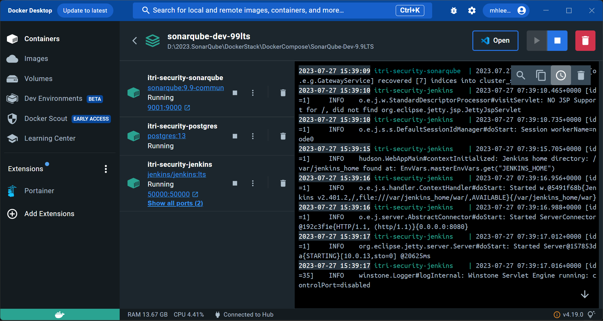


SonarQube http://localhost:9000

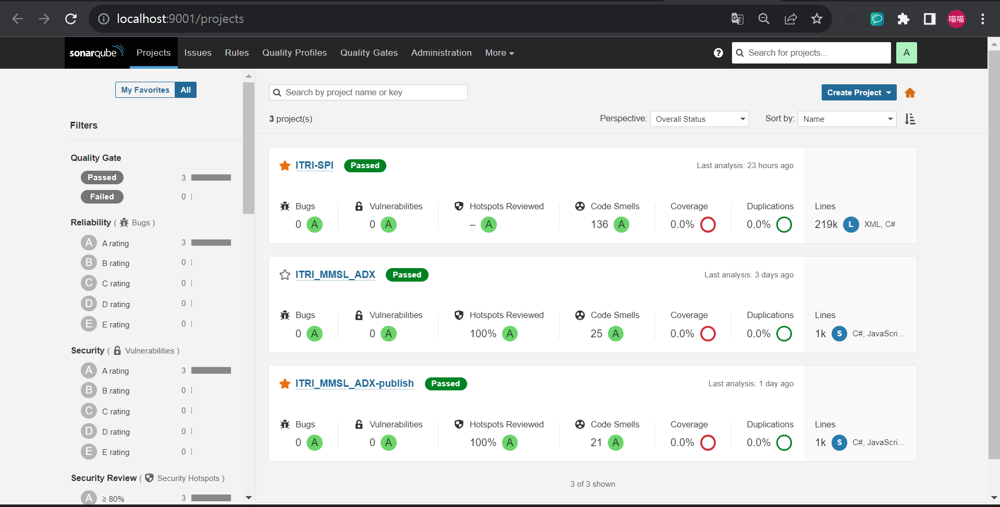


SonarQube 執行畫面示意圖

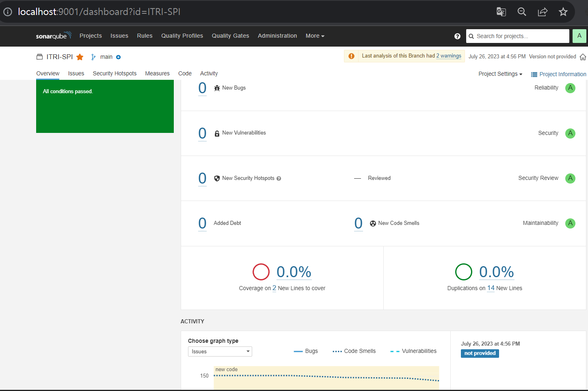


SonarQube 執行畫面示意圖

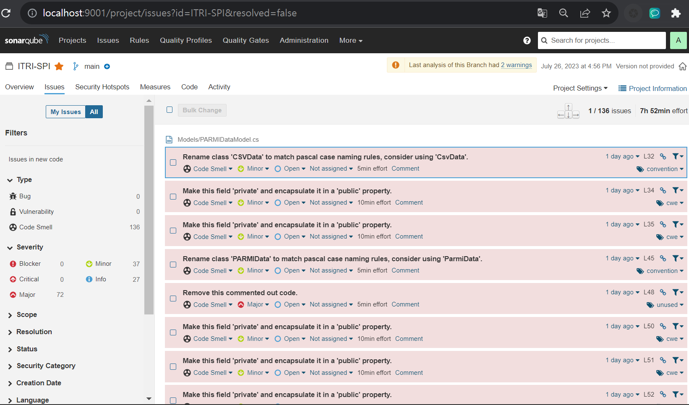


Jenkins  執行畫面示意圖

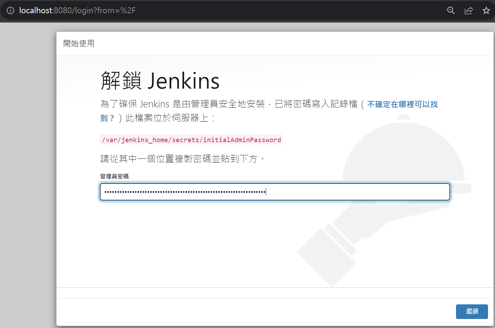

Jenkins  執行畫面示意圖

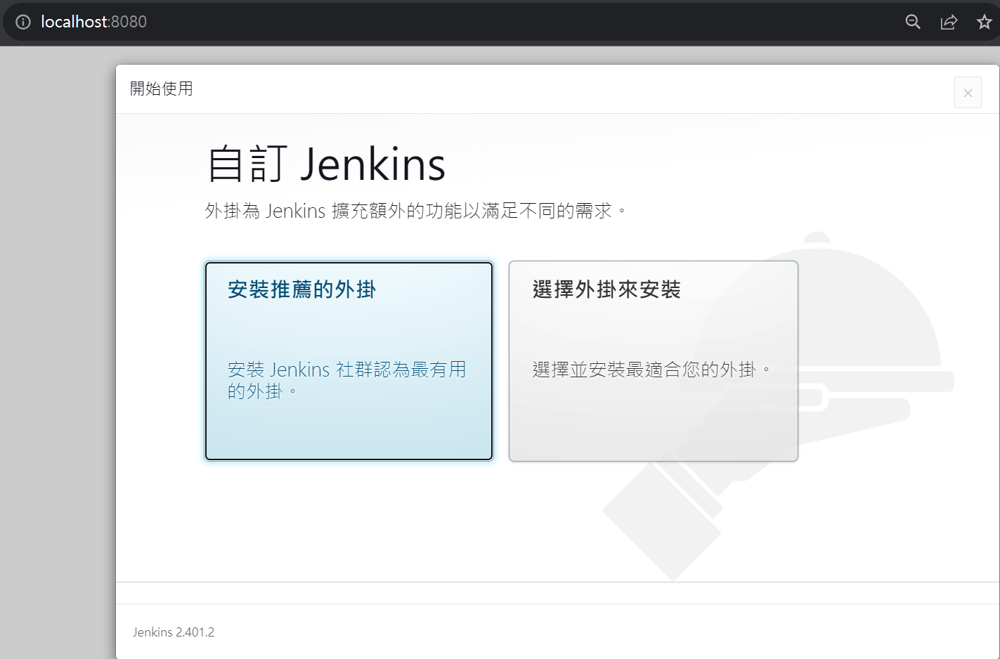


Community 版本  SonarScanner 自行各種程式語言會用到的CLI 命令

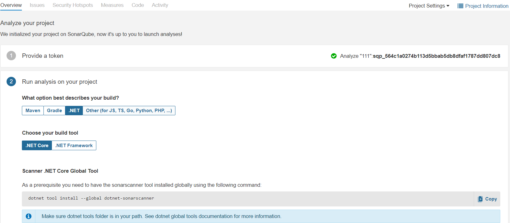


.net Framework 版本

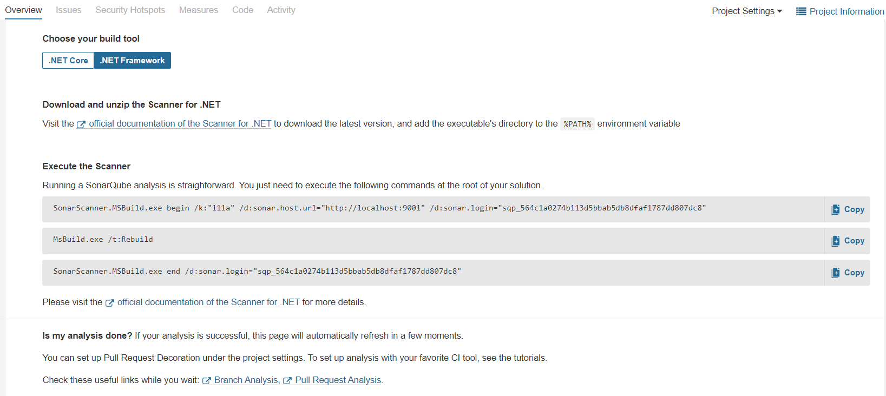


.net Core版本

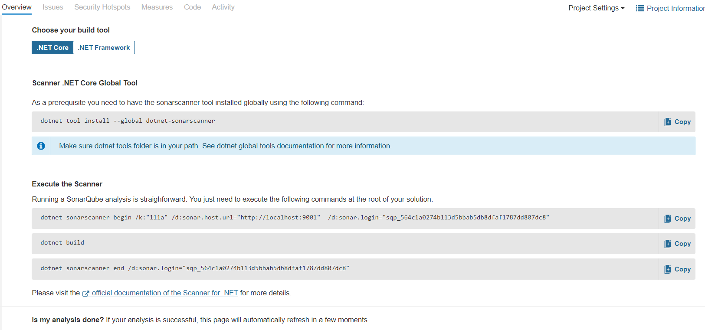

自動執行弱點掃瞄的腳本 !  注意這裡我寫的的 powershell 腳本範例適用於 " .net C# Core " 專案 

實際上用戶必須根據自己的專案類型， 修改你的腳本命令 ! 

YourScanFolder
    └─YourAppProject
            940115_RunSonarScanner-9.9LTS.ps1

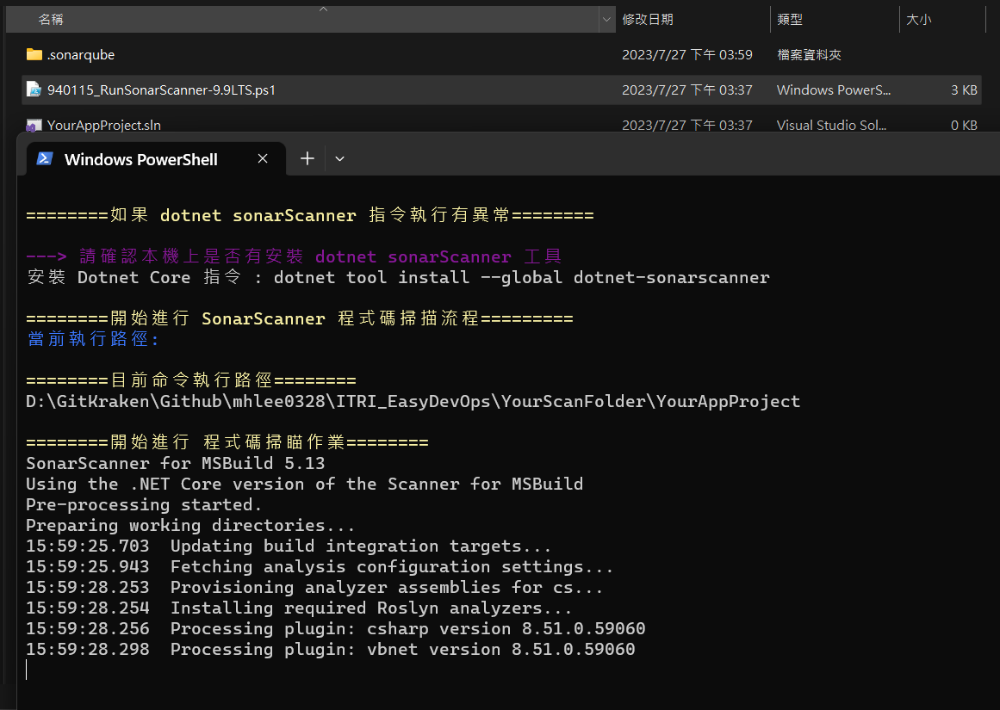


YourScanFolder
    └─YourAppProject 最後完成弱點修正後 , 可供下載 Report ! 

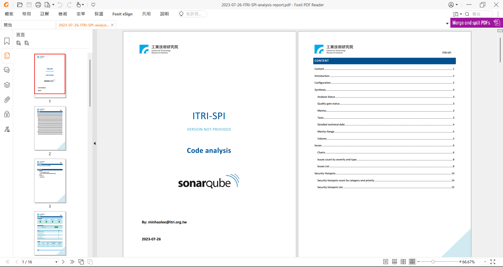